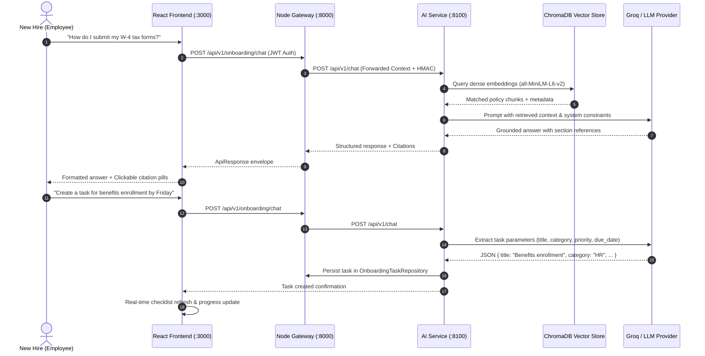

# OptiAgent — HR Onboarding AI Employee

> **Deloitte Technology Consulting Capstone 2026**  
> *An enterprise-grade, governance-aware conversational AI assistant designed for automated employee onboarding, grounded policy intelligence, and multi-turn task tracking.*

[](https://www.typescriptlang.org/)
[](https://www.python.org/)
[](https://fastapi.tiangolo.com/)
[](https://react.dev/)
[](https://langchain-ai.github.io/langgraph/)
[](https://www.prisma.io/)
[](https://redis.io/)
[](https://www.trychroma.com/)

---

## 📌 Executive Summary & Scenario

### The Problem
Traditional enterprise employee onboarding is fragmented across disparate document repositories, static FAQ sheets, and manual checklists. New hires struggle to quickly find authoritative answers regarding healthcare benefits, payroll elections, IT provisioning, and corporate policies, while HR teams bear significant administrative overhead.

### The Solution
**OptiAgent HR Onboarding AI Employee** delivers an autonomous, context-aware onboarding companion. It seamlessly guides new employees through their first 90 days by combining:
1. **Grounded Policy Intelligence (RAG)**: Precise question answering with citation provenance across HR, IT, and Finance documentation.
2. **Stateful Task Management**: Automated creation, tracking, and status updating of onboarding action items through natural dialogue.
3. **Dual-Pane Interactive Hub**: A unified workspace pairing real-time conversational assistance with an actionable, categorized checklist.

---

## 🎯 Deloitte Capstone Evaluation Matrix

| Evaluation Dimension | Solution Implementation & Architectural Guarantee |
| :--- | :--- |
| **Groundedness & Accuracy** | Multi-stage Retrieval-Augmented Generation (RAG) using semantic chunking, local dense embeddings (`all-MiniLM-L6-v2`), similarity thresholding, and verifiable source document citation badges. |
| **Task-Tracking Correctness** | Bidirectional state management supporting fuzzy title matching, automated parameter extraction (category, priority, due date), and real-time progress recalculation across multi-turn sessions. |
| **Conversational Design** | Modern dual-pane UI with rich markdown rendering, suggested quick prompt chips, interactive inspection modals, and smooth state synchronization between chat and task components. |
| **Security & Governance** | End-to-end Role-Based Access Control (RBAC), RS256 JWT validation, sliding token-bucket rate limiting via Redis, and internal service HMAC token isolation. |

---

## 🏗️ System Architecture

The platform is architected as a production-grade monorepo adhering to **Domain-Driven Design (DDD)** and **Clean Architecture** principles across three independently scalable services:

```
                                 ┌─────────────────────────────────────────┐
                                 │       React 19 SPA Frontend (:3000)     │
                                 │   Dual-Pane Workspace · RTK Query Client│
                                 └────────────────────┬────────────────────┘
                                                      │ HTTPS / REST
                                                      ▼
                                 ┌─────────────────────────────────────────┐
                                 │       Node.js / Express Gateway (:8000) │
                                 │    Inversify DI · RBAC · Rate Limiter   │
                                 └─────────┬─────────────────────┬─────────┘
                                           │                     │
                        ┌──────────────────┴────────┐   ┌────────┴────────────────┐
                        ▼                           ▼   ▼                         ▼
            ┌──────────────────────┐    ┌────────────────────┐      ┌───────────────────────────┐
            │ PostgreSQL (Prisma)  │    │ Redis Token Bucket │      │ FastAPI AI Service (:8100)│
            │ Users, Roles, Audit  │    │ Cache & Session    │      │ LangGraph Supervisor Node │
            └──────────────────────┘    └────────────────────┘      └─────────────┬─────────────┘
                                                                                  │
                                                       ┌──────────────────────────┴──────────┐
                                                       ▼                                     ▼
                                           ┌────────────────────────┐            ┌────────────────────────┐
                                           │  ChromaDB Vector Store │            │  Groq / LLaMA / OpenAI │
                                           │  375 Semantic Chunks   │            │  Low-Latency LLM       │
                                           └────────────────────────┘            └────────────────────────┘
```

### Architectural Layering

1. **Presentation Layer (`web/frontend`)**:
   - Built with React 19, Vite, Tailwind CSS, and Redux Toolkit Query.
   - Dual-pane layout: Conversational assistant with markdown formatting and citation badges on the left; interactive checklist with category filtering (`HR`, `IT`, `Finance`, `Compliance`) and animated progress metrics on the right.

2. **API Gateway & Core Domain Layer (`web/backend`)**:
   - Built with TypeScript, Express, and InversifyJS (IoC/DI).
   - Enforces RBAC permissions, audit logging, RS256 cryptographic JWT authentication, and token bucket rate limiting via Redis.
   - In-memory onboarding task repository with transactional synchronization and automatic seed provisioning for new hires.

3. **Cognitive Orchestration Layer (`web/ai-service`)**:
   - Built with Python 3.11, FastAPI, LangGraph, and LangChain.
   - Bootstraps and embeds raw enterprise policies on startup into ChromaDB.
   - LangGraph supervisor node routes user intent dynamically between policy retrieval (RAG) and conversational task execution (`TaskTool`).

4. **Shared Contracts Layer (`shared/`)**:
   - Pure TypeScript library defining shared DTOs, Zod validation schemas, Role/Permission enums, and standard `ApiResponse<T>` envelopes consumed at compile time.

---

## ⚡ Core Capabilities & Workflows



---

## 🚀 Quick Start & Deployment

### Prerequisites
- **Node.js**: `v20.x` or later
- **Package Manager**: `pnpm v8+`
- **Python**: `v3.11` with `pip`
- **Infrastructure**: PostgreSQL 16 (`:5432`) and Redis 7 (`:6379`) running locally or via Docker

### 1. Repository Setup & Dependencies
```bash
# Clone the repository
git clone https://github.com/noupadasankar/Onboarding.git
cd Onboarding

# Install Node monorepo dependencies
pnpm install

# Install Python AI service dependencies
cd web/ai-service && pip install -e ".[dev]" && cd ../..
```

### 2. Environment Configuration
Copy the provided `.env.example` templates in each service directory:
- `web/backend/.env.example` → `web/backend/.env`
- `web/ai-service/.env.example` → `web/ai-service/.env`

*(Generate the backend RS256 keypair on first run: `node web/backend/scripts/generate-keys.mjs`)*

### 3. Launching Services

Start the services in separate terminals:

```bash
# Terminal 1: AI Cognitive Service (FastAPI + LangGraph)
cd web/ai-service
python -m uvicorn app.main:app --port 8100

# Terminal 2: Core Backend Gateway (Express + Prisma)
pnpm --filter @hr-onboarding/backend dev

# Terminal 3: Web Client (React 19 + Vite)
pnpm --filter @hr-onboarding/frontend dev
```

The application will be accessible at:
- **Web Client**: [`http://localhost:3000`](http://localhost:3000)
- **REST API & Swagger Docs**: [`http://localhost:8000/docs`](http://localhost:8000/docs)
- **AI Service Health**: [`http://localhost:8100/api/v1/health`](http://localhost:8100/api/v1/health)

---

## 🔑 Demo Access Credentials

The database comes pre-seeded with standardized personas across key enterprise roles:

| Persona | Email | Password | Role & Scope |
| :--- | :--- | :--- | :--- |
| **New Hire (Default)** | `employee@optiagent.dev` | `Password123!` | Onboarding assistant, personal task checklist, policy queries |
| **HR Manager** | `hr.manager@optiagent.dev` | `Password123!` | Organization-wide onboarding metrics, document management |
| **IT Administrator** | `it.admin@optiagent.dev` | `Password123!` | System access policies, user management, device provisioning |
| **Finance Administrator** | `finance.admin@optiagent.dev` | `Password123!` | Payroll guidelines, direct deposit, expense policy management |

---

## 🧪 Verification & Quality Assurance

The codebase enforces strict end-to-end quality benchmarks:

```bash
# Execute backend unit and integration test suites (45 tests)
pnpm --filter @hr-onboarding/backend test

# Execute workspace-wide TypeScript type checking
pnpm typecheck

# Run Python AI service test suite
cd web/ai-service && pytest
```

### Key Validation Metrics
- ✅ **100% Strict Type Safety**: 0 errors across `@hr-onboarding/shared`, `@hr-onboarding/backend`, and `@hr-onboarding/frontend`.
- ✅ **45/45 Passing Tests**: Full coverage across authentication, authorization guards, user lifecycle, and onboarding routes.
- ✅ **Deterministic Rate Limiting**: Token-bucket sliding window with safe error dispatching.

---

## 📁 Repository Structure

```
.
├── web/
│   ├── frontend/                  # React 19 Single Page Application
│   │   └── src/features/onboarding/
│   │       ├── api/               # RTK Query API endpoints
│   │       ├── components/        # ChatMessage, TaskList, TaskFormModal, CitationModal
│   │       └── pages/             # OnboardingChatPage.tsx (Dual-Pane Hub)
│   ├── backend/                   # Node.js TypeScript API Gateway
│   │   ├── prisma/                # Database schema, migrations & seed scripts
│   │   └── src/
│   │       ├── core/              # Inversify DI, HTTP envelopes, error pipelines
│   │       ├── middleware/        # JWT auth, RBAC permissions, Redis rate limiter
│   │       └── modules/onboarding/# Domain entities, services, memory repo, controllers
│   └── ai-service/                # Python FastAPI AI Microservice
│       └── app/
│           ├── agents/onboarding/ # Onboarding agent node & intent router
│           ├── embeddings/        # SentenceTransformer local embeddings provider
│           ├── rag/               # Semantic chunking & retrieval pipelines
│           └── tools/             # TaskTool (CRUD + fuzzy matching) & RetrievalTool
├── shared/                        # Cross-service TypeScript contracts & schemas
├── data/raw/                      # Raw enterprise policy files (HR, IT, Finance)
└── docs/                          # Architecture Decision Records (ADRs) & specs
```

---

## 📄 License & Attribution
Developed for the **Deloitte Technology Consulting Capstone Program 2026**.  
*All rights reserved.*

