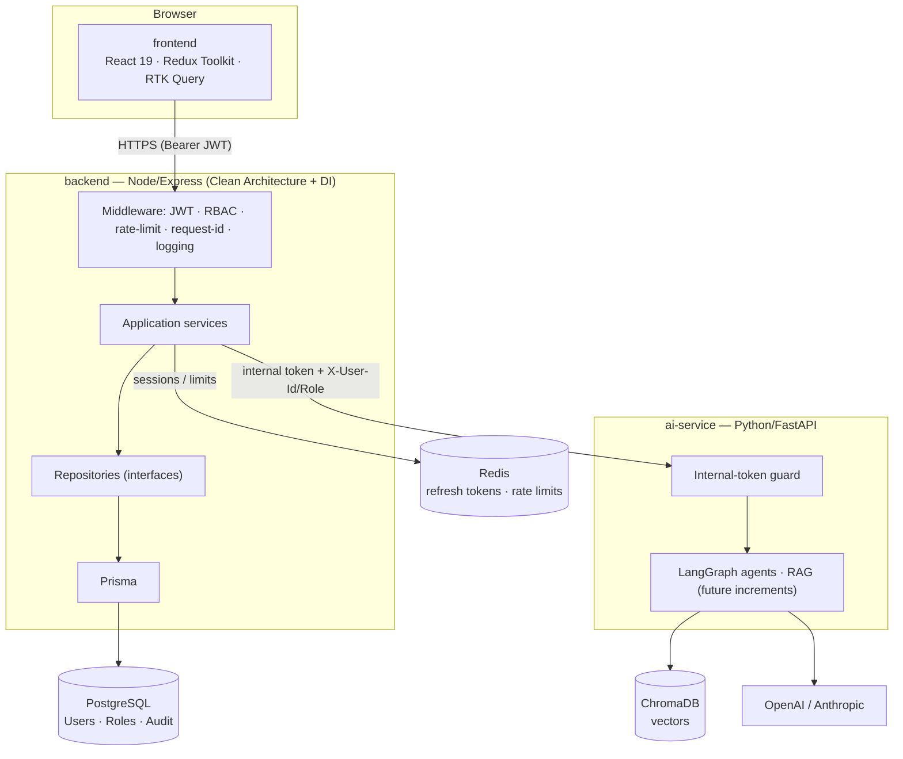

# OptiAgent — System Architecture Overview

OptiAgent is a three-service platform. Each service has a single responsibility and a
well-defined boundary; they communicate over HTTP(S)/WSS with explicit contracts.

## Service topology

## Responsibilities & boundaries

| Concern | Owner | Notes |
|---|---|---|
| Authentication, refresh, logout | **backend** | RS256 JWT; Python never authenticates users |
| Authorization (RBAC / permissions) | **backend** | Enforced in middleware before controllers |
| CRUD & business logic | **backend** | Route→MW→Validator→Controller→Service→Repo→Prisma |
| Relational data | **backend** (PostgreSQL) | Users, Roles, Permissions, Audit |
| Agents, RAG, embeddings, memory | **ai-service** | Trusts the gateway via internal token |
| Vector store, prompt templates | **ai-service** (ChromaDB + Alembic) | No CRUD business logic here |
| UI, routing, state | **frontend** | Feature-first; RBAC-aware routing |
| Shared DTOs / RBAC / Zod | **shared** | Imported by frontend + backend |

## Cross-service trust model

The browser holds a short-lived RS256 access token. The Node gateway verifies it, resolves
the principal + permissions, and — only for AI requests — calls the Python service with an
**internal service token** plus `X-User-Id` / `X-User-Role` headers. The Python service
verifies the internal token and trusts those headers; it has no notion of end-user login.

See [ADR 0001](adr/0001-three-service-split.md) and [ADR 0002](adr/0002-node-gateway-python-ai.md).
