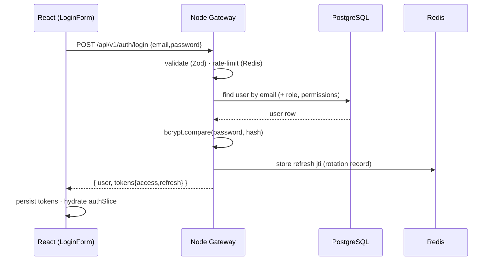
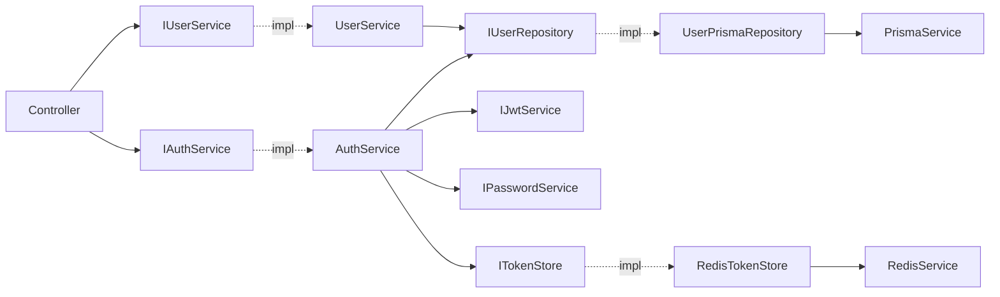

# Architecture — Authentication / Users / RBAC Vertical Slice

This is the **reference implementation**. Every future module (HR, Finance, IT, Governance,
…) copies this exact layering. The ten points below are the mandated architecture rationale.

---

## 1. Why this architecture is chosen

We use **Clean Architecture** with **feature (vertical-slice) modules** and **Dependency
Injection** (InversifyJS). The dependency rule points inward: HTTP/Prisma/Redis (outer,
volatile) depend on the domain (inner, stable) — never the reverse.

- **Controllers** translate HTTP ↔ application calls. No business logic, no DB access.
- **Services** hold business logic and depend on **repository interfaces**, not Prisma.
- **Repositories** are the only place that touches Prisma.
- **Domain** types/entities are framework-free and trivially unit-testable.

This directly satisfies the project rules: *never write business logic in controllers, never
access Prisma from controllers/routes, always use interfaces + DI, separate domain from
infrastructure.*

## 2. How it scales

- **Stateless workers.** Auth state lives in the RS256 JWT + Redis, not in process memory, so
  any request can hit any backend instance. Add replicas behind NGINX to scale horizontally.
- **Redis** holds refresh-token records, a logout blacklist, and the rate-limit token bucket —
  shared across all instances.
- **PostgreSQL** connection pooling via a single Prisma client per process.
- The AI service scales independently; the gateway is the only thing that must authenticate.

## 3. Why this follows enterprise standards

SOLID (interface-segregated repos, single-responsibility services), DRY (shared DTOs/Zod in
`@optiagent/shared`), Repository + Service-Layer patterns, DI container as composition root,
Strategy-friendly guards (`requirePermission`). Files stay well under the 300–400 line ceiling
and each folder has one responsibility.

## 4. Folder structure (backend)

```
backend/src
├── main.ts                     # composition root: build container, start server
├── app.ts                      # Express app factory (middleware order lives here)
├── config/env.ts               # Zod-validated environment (fail-fast at boot)
├── core/
│   ├── di/{types,container}.ts  # DI symbols + container assembly
│   ├── errors/*                 # AppError, HttpError, error-handler middleware
│   ├── logging/logger.ts        # Pino
│   ├── http/*                   # async-handler, response helpers
│   └── result/result.ts         # Result<T,E>
├── infrastructure/
│   ├── database/prisma.service.ts
│   ├── cache/redis.service.ts
│   └── security/{jwt,password,token-store}.service.ts
├── middleware/                  # authenticate, authorize, validate, rate-limit, request-id, logger
└── modules/
    ├── auth/  (domain, application, controller, validators, routes, container)
    └── users/ (domain incl. IUserRepository, prisma repo impl, service, controller, routes)
```

## 5. Data flow (login)



## 6. Request flow (protected + RBAC)

```
Route  →  requestId  →  requestLogger  →  authenticate(JWT)  →  authorize(permission)
       →  validate(Zod)  →  Controller  →  Service  →  RepositoryInterface
       →  PrismaRepository  →  Prisma  →  PostgreSQL
```

`GET /api/v1/users` requires `users:read`. An `EMPLOYEE` (no grant) receives **403**;
`HR_MANAGER` / `FINANCE_ADMIN` / `IT_ADMIN` succeed.

## 7. Dependency graph



Everything is wired through the Inversify container in `core/di/container.ts`, so any
dependency can be swapped or mocked in tests without touching call sites.

## 8. Security considerations

- **RS256** access tokens (15 min) + rotating **refresh** tokens (7 days) with a Redis
  blacklist for immediate logout invalidation.
- **bcrypt** (work factor 12) password hashing; plaintext never logged or returned.
- **RBAC** enforced in middleware *before* any business logic executes.
- **helmet**, strict **CORS** allowlist, **request-id** correlation, **rate limiting** on login.
- Uniform error envelope avoids leaking internals; validation errors are field-scoped.

## 9. Performance considerations

- P90 login dominated by one indexed lookup + one bcrypt compare (bounded, tunable via cost).
- JWT verification is CPU-only (no DB round-trip on protected reads).
- Redis token-bucket rate limiting is O(1); refresh/blacklist checks are single GETs.
- Prisma client reused per process; `email` is uniquely indexed.

## 10. Testing strategy

- **Unit** (`tests/unit`): `AuthService` with mocked repo/jwt/password/token-store — pure logic,
  no I/O. This is why services depend on interfaces.
- **Integration** (`tests/integration`): supertest drives the real Express app with the
  data/security layer faked at the container boundary, asserting status codes, RBAC 403s,
  refresh rotation, and logout blacklisting.
- **Contract**: DTOs/Zod come from `@optiagent/shared`, so client and server test the same shapes.
